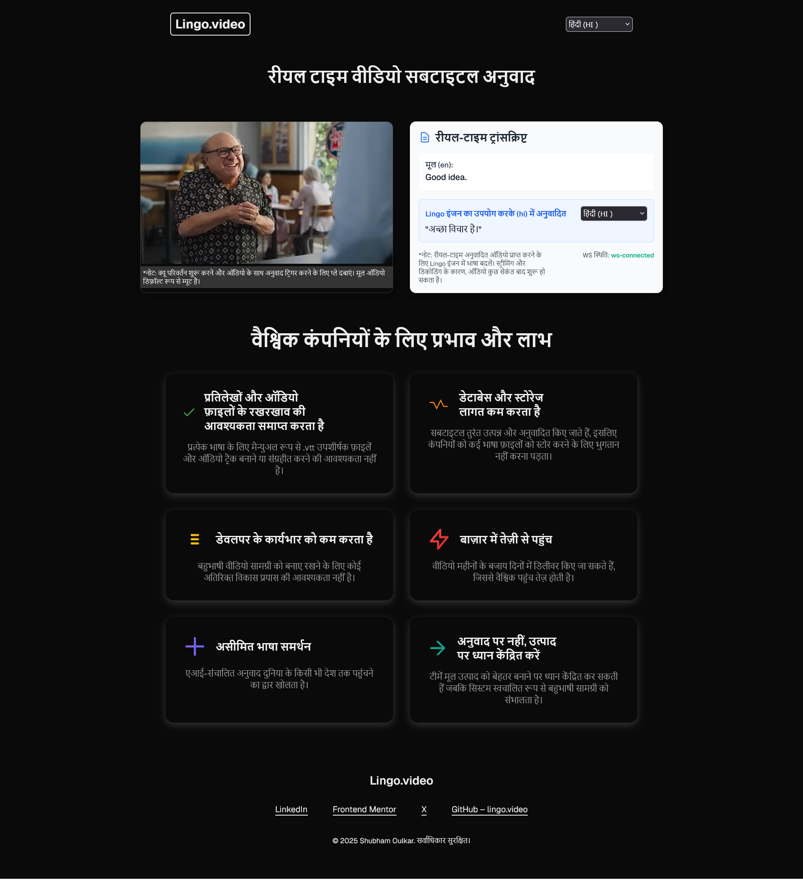

# 🎬 Real-Time Audio + Subtitle Translation Engine for Global Content

## Problem Statement

Global companies rely heavily on video content for marketing, product education, training, and international outreach. However, most video assets are created in a single language typically in English. Translating these videos manually into multiple languages requires: human translators, voiceover artists, subtitle file creation and formatting, repeated engineering work for UI and SEO localization.

The challenge becomes far more complex when translation needs to be real-time, such as: live product demos, training sessions, user education websites, continuous content creation. Traditional translation workflows cannot meet real-time requirements.
This project solves that problem by creating a Real-Time Multilingual Video & Audio Translation System that automatically translates: Speech → Text → Translated Text → Translated Audio → Subtitles in real time



## Table of Contents
- [lingo.video website](https://lingo-video.vercel.app/)
- [YouTube video](https://youtu.be/AUdZw9KzZzw)
- [Installing](#getting-started)
- [Real-Time Video Subtitles Translation architecture and tech stack](./docs/live-translation-architecture.md)
- [Impact & Benefits for Global Companies](#impact--benefits-for-global-companies)
- [Features](#features)
- [Challenges with Real-Time Translation & How We Solve Them](#challenges-with-real-time-translation--how-we-solve-them)
- [What is next?](./docs/what-is-next.md)
- [Author](#author)
- [License](#license)

## Getting Started
1. Clone repository
```
git clone https://github.com/ShubhamOulkar/lingo.video.git
cd lingo.video
```
2. Install dependencies
```
pnpm install
```
3. Get lingo.dev api key from [`lingo.dev`](https://lingo.dev/)
4. Create `.env` file and store `LINGODOTDEV_API_KEY`
5. Run frontend and websocket server concurrently
```
pnpm dev
```


## Impact & Benefits for Global Companies
This system offers tangible benefits for organizations, especially global food and delivery companies:

- `Eliminates VTT and audio file maintenance`: No need to manually create or store .vtt subtitle files for each language.

- `Reduces database and storage costs`: Subtitles are generated and translated on the fly, so companies don’t pay for storing multiple language files.

- `Minimizes developer workload`: No extra development effort is required to maintain multilingual video content.

- `Reach markets early`: Videos can be shipped in days instead of months, accelerating global reach.

- `Unlimited language support`: AI driven translation opens the door to reaching any country in the world.

- `Focus on product, not translation`: Teams can concentrate on improving the core product while the system handles multilingual content automatically.

## Features

- **Real-Time Subtitle Translation**  
  - Translates video subtitles on the fly using [`lingo.dev`](https://lingo.dev/en/sdk) SDK and a WebSocket server.   
  - No need to maintain `.vtt` files for multiple languages.
  > Note: This repository includes [.vtt files](./apps/next-app/public/subtitles/emotions.hi.vtt) for manual accuracy testing. You can test it by clicking on `CC` and comparing with live translation.

- **UI Translation in React**  
  - React UI automatically updates using [`Lingo Compiler`](https://lingo.dev/en/compiler) ⚡🤖.  
  - Dynamic language compilation without hardcoding translations.  

- **SEO-Friendly Multilingual Content**  
  - Automatically generates meta tags and Open Graph (OG) tags using [`Lingo CLI`](https://lingo.dev/en/cli).  
  - Fully automatable via CI/CD pipelines.
  > note: Verify og cards for hindi [here](https://opengraph.dev/panel?url=https%3A%2F%2Flingo-video.vercel.app%2Fhi) 

- **Time and Cost Efficiency**  
  - Reduces developer effort and eliminates third party translators.  
  - Ship multilingual content in **days instead of months**.  

- **Unlimited Language Support**  
  - AI driven translation allows reaching any country worldwide.  
  - Easily add new languages without manual work.  

- **Focus on Product, Not Translation**  
  - Teams can concentrate on improving the core product while translations happen automatically.  

- **Scales with Video Volume**  
  - Can handle large numbers of videos without extra infrastructure or maintenance.

- **Adopt to user prefered system theme** 
  - Website can adopt automatically to user prefered light or dark theme.

## Challenges with Real Time Translation & How We Solve Them
Real-time translation systems face several technical and operational challenges. This project is designed with production grade solutions to minimize latency, reduce translation costs, and ensure consistent accuracy across high-volume video content.

### ⚠️ Core Challenges

1. **Network Latency** : Real time translation requires fast WebSocket communication. Any network instability can delay subtitle updates.

2. **LLM Token Generation Delay** : Translation quality depends on the speed of token generation from the LLM. High load or large subtitles can increase response time. Lingo SDK do not support streaming.

3. **Redundant Translation Costs** : Many subtitles repeat the same text across videos. Without optimization, the same token generation is billed multiple times.

4. **Cold Start Issues** : Serverless deployments can experience slow startup times, affecting real-time subtitle delivery.

5. **Scaling with High Traffic** : Multiple users watching videos simultaneously can overload translation or socket servers if not optimized.

## Author
- [LinkedIn](www.linkedin.com/in/shubham-oulkar)
- [Frontend Mentor](https://www.frontendmentor.io/profile/ShubhamOulkar)
- [X](https://x.com/shubhuoulkar)

## License
Content submitted by [shubham oulkar](https://github.com/ShubhamOulkar) is Creative Commons Attribution 4.0 International licensed, as found in the [LICENSE](/LICENSE) file.

## 🌐 Readme in other languages
[हिंदी](./docs/readmes/hi.md) • [日本語](./docs/readmes/ja.md) • [Français](./docs/readmes/fr.md) • [Deutsch](./docs/readmes/de.md) • [Español](./docs/readmes/es.md)
