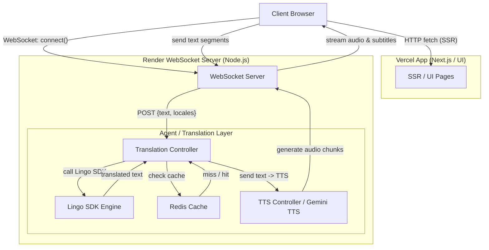

This project uses a production-grade architecture designed for **real-time translation** of both text and audio. It combines a dedicated WebSocket server (for persistent low-latency connections), a translation/agent layer, and a Vercel-hosted Next.js frontend. The monorepo is managed with Turborepo/Turbopack.

---

## **Overview**

* **WebSocket Server (Render)** — persistent Node.js server for streaming and orchestration.
* **Frontend (Vercel)** — Next.js UI for playback, language selection, and audio/subtitle rendering.
* **Translation & TTS Layer (Agent-driven)** — handles translation, audio generation, caching, and synchronization.

## **High-Level Architecture Diagram**

### **1. TTS Controller / Agent**

* A specialized agent (TTS Agent) receives translated text from the translation controller.
* It is responsible for:

  * Selecting voice/profile (language, gender, tone).
  * Chunking translated text into smaller segments suitable for streaming.
  * Calling the TTS model (Gemini TTS or configured TTS provider).
  * Encoding audio into streamable chunks (e.g., PCM/Opus/MP3 segments).
  * Returning audio buffers back to the WebSocket server for delivery.

### **2. Streaming & Low-Latency Playback**

* Audio is generated and streamed back as small binary frames over WebSocket.
* The frontend uses the Web Audio API to append incoming audio buffers to a playback buffer, ensuring smooth, low-latency audio output synchronized with subtitles.
* Chunk-level timestamps are used to align audio with subtitle updates and video playback.

### **3. Caching & Cost Optimization**

* The system caches:

  * Translated text fingerprints (hashes) in **Redis** to avoid redundant translations.
  * Generated audio segments (optionally) for frequently repeated lines to save TTS cost.
* The agent decides when to reuse cached audio vs. regenerate (based on TTL, voice settings, or quality flags).

### **4. Fallbacks & Resilience**

* If the primary TTS provider or network fails, the agent can:

  * Fall back to a secondary TTS service or a lower-latency pre-synthesized voice.
  * Degrade gracefully to subtitles-only mode while queuing TTS generation.
* Retries and exponential backoff are handled in the TTS agent to ensure availability.

### **5. Voice & Persona Options**

* The TTS agent supports selecting different voices or preserving speaker identity (voice-cloning planned as an enhancement).
* Voice parameters are passed from the frontend or system settings (e.g., "neutral", "energetic").

---

## **Technical Details — TTS Specifics**

* **TTS Engine**: Gemini TTS (primary) with an abstracted adapter to allow alternative providers.
* **Audio format**: Streamed as small PCM encoded chunks.
* **Buffering strategy**: Client-side audio buffer with timestamp alignment to video playback.
* **Latency targets**: Sub-second initial playback for short subtitle segments.
* **Caching**: Redis-based caching for translated text and optional audio caching for repeated phrases.

---

## **Updated Tech Stack**

| Layer               | Technology                      |
| ------------------- | ------------------------------- |
| Frontend            | Next.js (Vercel)                |
| WebSocket Server    | Node.js (Render)                |
| Translation Engine  | `lingo.dev/sdk`, Lingo Compiler |
| Agent Orchestration | Custom agent layer (Node)       |
| TTS Engine          | Gemini TTS (primary)            |
| Cache / Storage     | Redis                           |
| Monorepo            | Turborepo / Turbopack           |
| Language            | TypeScript / JavaScript         |

---
